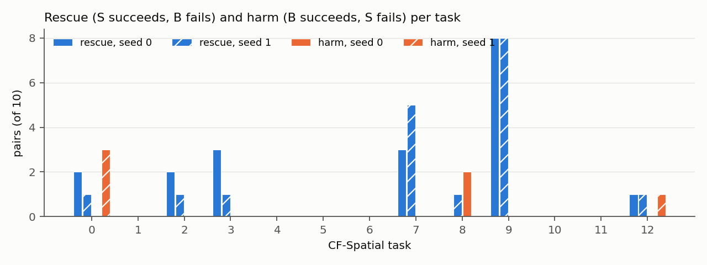

# S2b: causal effect of CAG-TF on π0.5 under common random numbers

Label: **DISCOVERY.** Preregistered in `configs/cag/S2b_prereg.yaml`, frozen before launch
(`results/S2b/PREREG_FROZEN.txt`). Date: 2026-10-05.

Setup:
* conditions: B = vanilla π0.5; S = π0.5 + CAG-TF (ω = 1.5); executed h = 5 of predicted H = 10;
* tasks: all 13 valid CF-Spatial tasks (0–12), initial states 20–29;
* noise: master seeds 0 and 1, exact CRN (`S2B_RNG_VALIDATION.md`);
* 520 episodes = 260 B/S pairs.

States 30–49 were not executed. The client refused any index ≥ 30.

Analysis: `src/analysis/analyze_s2b.py` → `results/S2b/s2b_summary.json`; pair checks:
`results/S2b/pair_checks_seed{0,1}.json`.

## Validity

| Check (per B/S pair) | seed 0 | seed 1 |
|---|---|---|
| pairs / valid | 130 / **130** | 130 / **130** |
| static geometry + initial sim state identical | 130 | 130 |
| CRN tuple correct at every call; B = S noise fingerprint at every common call index | 130 | 130 |
| call-0 observation identical | 130 | 130 |
| B call-0 chunk == S call-0 conditioned (pre-CAG) chunk, **bit-for-bit** | 130 | 130 |
| diagnostic re-runs bit-identical | 130 | 130 |
| first call where B and S observations differ | call 1 in 130/130 | call 1 in 130/130 |
| exceptions | 0 | 0 |
| max CAG reconstruction error | 4.2e-7 | 3.0e-7 |

Other validity facts:
* Seeds 0 and 1 share scenes: B seed 0 and B seed 1 geometry is identical in 130/130 states, because env seed 7
  and the reset order are fixed. The two seeds differ only in policy noise.
* No primary feature was NaN in any of the 6,109 S policy calls (near-zero rule never triggered on the combined
  residual).
* Mean episode length: B 114.3, S 116.0 steps. Mean policy calls: 23.2 vs 23.5.

## Primary outcomes (faithful = instructed task)

| | seed 0 B → S | seed 1 B → S | pooled B → S |
|---|---|---|---|
| faithful success | 36 → **53** | 36 → **50** | 72 → **103** / 260 (27.7 % → 39.6 %) |
| faithful touch | 46 → 63 | 50 → 62 | 96 → 125 |
| biased touch | 78 → 63 | 77 → 65 | 155 → 128 |
| biased success | 72 → 52 | 74 → 58 | 146 → 110 |
| biased object touched first | 74 → 62 | 72 → 61 | 146 → 123 |

**Paired tests (CRN pairs make them legitimate here, unlike S2).**

Exact McNemar, discordant counts B1S0 vs B0S1:

| | seed 0 | seed 1 |
|---|---|---|
| faithful success | 2 vs 19, p = 2.2e-4 | 4 vs 18, p = 4.3e-3 |
| faithful touch | 1 vs 18, p = 7.6e-5 | 2 vs 14, p = 4.2e-3 |
| biased touch | 17 vs 2, p = 7.3e-4 | 16 vs 4, p = 0.012 |
| biased success | 21 vs 1, p = 1.1e-5 | 18 vs 2, p = 4.0e-4 |

Pooled state-cluster sign-flip permutation (10,000 permutations; both seeds of a state flipped together):

| | S − B | p |
|---|---|---|
| faithful success | +31 | 2e-4 |
| faithful touch | +29 | < 1e-4 |
| biased touch | −27 | 8e-4 |
| biased success | −36 | < 1e-4 |

**Under exact noise pairing, CAG-TF at the paper's ω causally improves instruction following on these states, in
both seeds.** The S2 pilot did not show this because 2 of its 3 tasks were at ceiling (see "Relation to the S2
pilot" below).

## Rescue, harm, semantic correction

| | seed 0 | seed 1 | pooled | rate |
|---|---|---|---|---|
| **rescue** (TE_success = +1) | 19 | 18 | **37** | 14.2 % of pairs; 19.7 % of B failures (37/188) |
| **harm** (TE_success = −1) | 2 | 4 | **6** | 2.3 % of pairs; 8.3 % of B successes (6/72) |
| **semantic correction** (B biased-first → S faithful-first) | 16 | 14 | **30** | 11.5 % of pairs; 20.5 % of B biased-first (30/146) |
| semantic regression (B faithful-first → S biased-first) | 1 | 1 | 2 | |

TE_faithful_touch: +1 ×32, −1 ×3. TE_biased_touch: −1 ×33, +1 ×6. TE_biased_success: −1 ×39, +1 ×3.

### Semantic transitions (first labelled object contacted), pooled

| B → S | n | TE_success +1 / 0 / −1 |
|---|---|---|
| biased → biased | 116 | 0 / 116 / 0 |
| faithful → faithful | 86 | 8 / 72 / **6** |
| **biased → faithful** | **30** | **27** / 3 / 0 |
| neither → neither | 17 | 0 / 17 / 0 |
| neither → biased | 4 | 0 / 4 / 0 |
| neither → faithful | 2 | 2 / 0 / 0 |
| faithful → biased | 2 | 0 / 2 / 0 |
| other (both/neither) | 3 | 0 / 3 / 0 |

### Outcome-class transitions, pooled (largest cells)

| B → S | n |
|---|---|
| B-success → B-success | 107 |
| F-success → F-success | 66 |
| **B-success → F-success** | **26** |
| neither → neither | 17 |
| B-success → B-first-no-success | 10 |
| F-first-no-success → F-first-no-success | 6 |
| **F-success → F-first-no-success** | **5** |
| B-first-no-success → F-success | 5 |
| F-first-no-success → F-success | 4 |

The two effects are kept separate, but they line up:
* 27 of 37 rescues are semantic corrections (biased → faithful).
* All 6 harms happen inside faithful → faithful: CAG kept the correct object but the task then failed. In 5 of the
  6, the episode touched the faithful object and timed out.

This is the S2-pilot task-0 pattern ("correct object touched → timeout"). Here it is real but rare: 6 of 260
pairs, against 30 semantic corrections.

### Per task (seed 0 / seed 1; 10 states each)

| task | prompt object | B success | S success | rescue | harm | sem. corr. | B biased-first (pooled /20) | S biased-first |
|---|---|---|---|---|---|---|---|---|
| 0 | cookie box | 4/4 | 6/2 | 2/1 | 0/**3** | 2/1 | 10 | 7 |
| 1 | ramekin | 0/0 | 0/0 | 0/0 | 0/0 | 0/0 | 20 | 20 |
| 2 | cookie box | 3/4 | 5/5 | 2/1 | 0/0 | 0/0 | 0 | 0 |
| 3 | cookie box | 0/1 | 3/2 | 3/1 | 0/0 | 3/2 | 19 | 14 |
| 4 | ramekin | 0/0 | 0/0 | 0/0 | 0/0 | 0/0 | 20 | 20 |
| 5 | ramekin | 0/0 | 0/0 | 0/0 | 0/0 | 0/0 | 10 | 14 |
| 6 | bowl on cookie box | 10/10 | 10/10 | 0/0 | 0/0 | 0/0 | 0 | 0 |
| 7 | cookie box | 0/0 | 3/5 | 3/5 | 0/0 | 3/3 | 13 | 10 |
| 8 | cookie box | 10/8 | 8/9 | 0/1 | **2**/0 | 0/0 | 0 | 0 |
| 9 | bowl next to ramekin | 0/0 | **8/8** | **8/8** | 0/0 | 8/7 | 19 | 4 |
| 10 | ramekin | 1/1 | 1/1 | 0/0 | 0/0 | 0/0 | 12 | 12 |
| 11 | bowl next to plate | 0/0 | 0/0 | 0/0 | 0/0 | 0/0 | 20 | 20 |
| 12 | bowl on cabinet | 8/8 | 9/8 | 1/1 | 0/**1** | 0/1 | 3 | 2 |

The effect is **strongly task-structured**:
* **Task 9 alone gives 16 of the 37 rescues.**
* In five tasks (1, 4, 5, 11, and nearly 10), vanilla π0.5 fails on essentially every state and CAG rescues
  none. This includes **every "ramekin" task**. In 1, 4, 5 and 11, the B and S biased-first counts are almost
  unchanged: CAG at ω = 1.5 does not move the policy off the training-goal object there.
* Tasks 6 and 8 are near ceiling.

## Per-seed consistency

Per state, the TE_success signs in seed 0 and seed 1:

| class | observed | expected if seeds were independent (given each task's per-seed TE rates) |
|---|---|---|
| stable positive (+,+) | **14** | 8.7 |
| stable negative (−,−) | **0** | 0.0 |
| neutral (0,0) | 102 | 96.6 |
| inconsistent | 14 | 24.7 |

The 14 inconsistent states break down as (+,0) 4, (0,+) 4, (0,−) 3, (−,0) 2, (+,−) 1.
* 8 of the 14 stable rescues are in task 9 and 3 in task 7.
* **Every harm occurs in a seed-inconsistent state:** task 0 states 26, 27, 28 (seed 1 only); task 8 states 27
  and 29 (seed 0 only); task 12 state 25 (+ in seed 0, − in seed 1). No state is harmed in both seeds.
* Semantic correction: 13 states corrected in both seeds, 4 in one seed only, 113 in neither.

Noise floor, on the same scenes:

| comparison | success discordance |
|---|---|
| B seed 0 vs B seed 1 (native noise only) | 6 / 130 (4.6 %) |
| S seed 0 vs S seed 1 | 9 / 130 (6.9 %) |
| B vs S within seed | 43 / 260 (16.5 %) |

Grounding (first object) discordance, B seed 0 vs B seed 1: 10 / 130.

Interpretation:
* **Rescues are mostly robust intervention effects.** They are concentrated in particular states and tasks, and
  more stable across seeds than chance predicts (14 vs 8.7).
* **Harms look like stochastic interactions:** 0 stable negatives, every harm seen in one seed only, and a total
  harm count about as large as the native B-vs-B flip rate would produce on its own.

## Relation to the S2 pilot

The pilot (states 0–19, tasks 0/6/12, native noise) found no semantic effect. Two reasons:
* Tasks 6 and 12 are at ceiling. That is again true here: 0 rescues on task 6; 2 rescues and 1 harm on task 12.
* Task 0 has a small effect in both directions, here 3 rescues vs 3 harms.

The deterministic first/median/last task rule happened to miss tasks 3, 7 and 9, which carry most of the effect.
S2b's all-task design, together with CRN pairing, makes the effect visible.

## What this does and does not show

* **Shown:** on CF-Spatial tasks 0–12, states 20–29, π0.5 + CAG-TF at ω = 1.5 raises faithful success by
  +11.9 pp (31/260 pairs net). It lowers biased touch and biased success. The effect replicates across two
  independent noise seeds.
* Not shown:
  * that the effect generalises beyond states 20–29;
  * that it holds at other ω;
  * any mechanism.

  The rescue/harm asymmetry (37 vs 6) means fixed-ω CAG is almost never worse than vanilla here. That matters
  directly for H1 (`S2B_COUNTERFACTUAL_GEOMETRY.md`): there is little harm for an adaptive steering rule to avoid.
