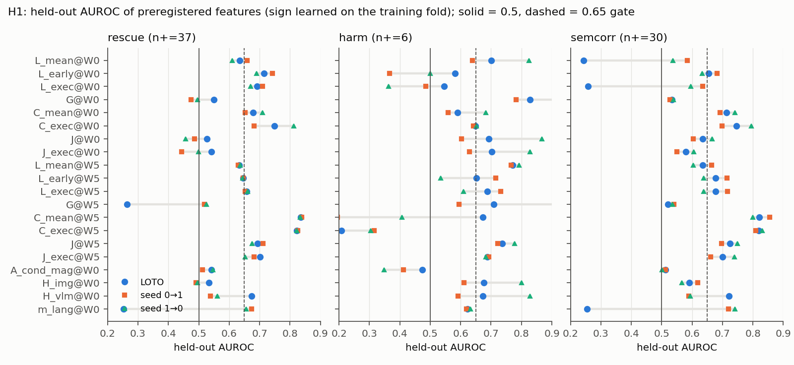
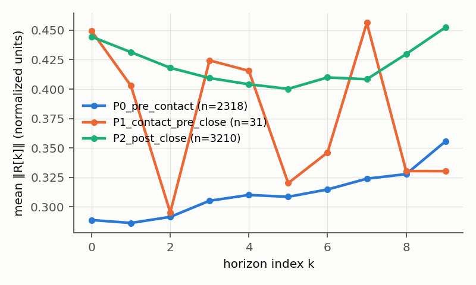

# S2b: counterfactual action geometry. H1 (does R(k) predict CAG benefit or harm?) and phase analysis

Label: **DISCOVERY.** Data: 260 valid CRN pairs (`S2B_CAUSAL_STEERING_EFFECT.md`). Preregistration:
`configs/cag/S2b_prereg.yaml`. Analysis: `src/analysis/analyze_s2b.py` → `results/S2b/s2b_summary.json` (`h1`,
`phase`). Post-hoc checks, marked **EXPLORATORY**: `src/analysis/s2b_exploratory.py` →
`results/S2b/s2b_exploratory.json`.

## Features (per S policy call)

R[k] = A_cond[k] − A_uncond[k], k = 0..9, from the logged pre-guidance chunks.
* Units: normalized (the model's quantile space, dims 0–6) and env units.
* Components: combined / translation / rotation / gripper.
* **Primary: normalized, combined.** All other unit/component variants are secondary and appear only in the JSON.

Distribution at call 0 (W0, 260 episodes), median [IQR]:

| feature | W0 | all calls (median) |
|---|---|---|
| L_mean = mean_k ‖R[k]‖ | 0.362 [0.211, 0.540] | 0.292 |
| L_early (k = 0–2) | 0.216 [0.141, 0.321] | 0.278 |
| L_exec (k = 0–4) | 0.290 [0.184, 0.424] | 0.279 |
| G (slope of ‖R[k]‖ on k) | 0.025 [0.006, 0.057] | 0.002 |
| C_mean (cos to mean residual) | 0.890 [0.828, 0.943] | 0.808 |
| C_exec | 0.939 [0.898, 0.971] | 0.939 |
| J = mean ‖R[k+1] − R[k]‖ | 0.089 [0.064, 0.114] | 0.090 |
| J_exec | 0.104 [0.069, 0.142] | 0.087 |

* d[k] at call 0 rises from 0.15 (k = 0) to 0.44 (k = 5) and then plateaus. Over all calls the profile is flat
  (0.27–0.30). At episode start the language-masked branch agrees with the conditioned one for the first actions
  and diverges over the chunk.
* The residual is highly coherent (C_exec ≈ 0.94), so in most calls it is a consistent direction rather than
  jitter.
* The near-zero rule never triggered on the primary features (0 NaN in 6,109 calls).

## H1: preregistered analysis

Unit: B/S pair. Primary window **W0 = S call 0**. It is strictly pre-treatment: its observation and noise equal
B's call 0, bit-for-bit verified. W5 = mean over S calls 0–4 is secondary and partially post-treatment.

Targets:

| target | positives | base rate | tasks with positives | studyable (≥ 15 and ≥ 3 tasks) |
|---|---|---|---|---|
| rescue | 37 | 14.2 % | 0, 2, 3, 7, 8, 9, 12 | **yes** |
| **harm** | **6** | 2.3 % | 0, 8, 12 | **no** |
| semantic correction | 30 | 11.5 % | 0, 3, 7, 9, 12 | yes |

### Univariate results, primary features (held-out AUROC: sign learned on the training fold)

AUROC is sign-adjusted. CI is the state-cluster bootstrap over the full data. "Within-task" counts only
positive/negative comparisons inside one task. Bold rows meet gate criteria (a)–(d).

**Rescue** (task-ID baseline, seed transfer: 0.887 / 0.875)

| feature | AUROC [95 % CI] | within-task | LOTO (sign folds) | seed 0→1 | seed 1→0 |
|---|---|---|---|---|---|
| **C_exec @W0** | 0.748 [0.621, 0.847] | 0.614 | 0.748 (13/13) | 0.682 | 0.813 |
| **L_early @W0** | 0.715 [0.602, 0.809] | 0.520 | 0.715 (13/13) | 0.743 | 0.690 |
| **d1 @W0** | 0.714 [0.597, 0.810] | 0.496 | 0.714 (13/13) | 0.734 | 0.692 |
| **d2 @W0** | 0.711 [0.604, 0.804] | 0.541 | 0.711 | 0.714 | 0.711 |
| **L_exec @W0** | 0.691 [0.584, 0.788] | 0.556 | 0.691 | 0.709 | 0.670 |
| **C_mean @W0** | 0.679 [0.549, 0.796] | 0.520 | 0.679 | 0.652 | 0.710 |
| **d3 @W0** | 0.671 | 0.567 | 0.671 | 0.671 | 0.671 |
| L_mean @W0 | 0.635 [0.536, 0.732] | 0.509 | 0.635 | 0.659 | 0.611 |
| G @W0 | 0.512 | 0.467 | 0.549 (10/13) | 0.475 | 0.496 |
| J @W0, J_exec @W0 | 0.52–0.53 | ≈ 0.5 | ≈ 0.53 | < 0.5 | ≈ 0.5 |
| **C_mean @W5** | **0.835 [0.749, 0.905]** | 0.685 | 0.835 | 0.839 | 0.834 |
| **C_exec @W5** | 0.822 [0.731, 0.898] | 0.606 | 0.822 | 0.825 | 0.822 |
| **J @W5** (lower → rescue) | 0.693 [0.564, 0.803] | 0.541 | 0.693 | 0.711 | 0.675 |
| **J_exec @W5**, **L_exec @W5** | 0.665, 0.657 | | 0.70, 0.66 | ≥ 0.65 | ≥ 0.65 |

**Semantic correction** (task-ID baseline: 0.903 / 0.939)

| feature | AUROC [95 % CI] | within-task | LOTO | seed 0→1 | seed 1→0 |
|---|---|---|---|---|---|
| **C_exec @W0** | 0.746 [0.601, 0.868] | 0.625 | 0.746 | 0.698 | 0.796 |
| **C_mean @W0** | 0.713 [0.564, 0.839] | 0.681 | 0.713 | 0.692 | 0.742 |
| **C_mean @W5** | 0.821 [0.715, 0.912] | 0.697 | 0.821 | 0.855 | 0.799 |
| **C_exec @W5** | 0.819 | 0.615 | 0.819 | 0.810 | 0.830 |
| **J @W5** (lower) | 0.725 | 0.615 | 0.725 | 0.697 | 0.749 |
| L_early @W0 | 0.654 | 0.451 | 0.654 | 0.682 | 0.633 (fails b) |
| d[k] @W0, k ≥ 3 | 0.53–0.60 | | unstable (LOTO ≈ 0.25: sign flips when task 9 is held out) | | |

**Harm (not studyable, n+ = 6; listed for completeness only)**
* G @W0 has AUROC 0.83 [0.71, 0.93], LOTO 0.83, seeds 0.78 / 0.92. d5–d9 @W0 have 0.72–0.76.
* With six positives from three tasks, all in seed-inconsistent states, these numbers are anecdotal. They are
  **not** evidence of a harm predictor.

**Comparators** (rescue, W0 / W5):

| comparator | W0 AUROC | W5 AUROC | note |
|---|---|---|---|
| image-only entropy (negative control) | 0.50 | 0.51 | **null, again** |
| generic action magnitude ‖A_cond‖ | 0.53 | 0.61 | |
| vlm entropy | 0.55 | 0.61 | |
| language mass | 0.67 | 0.73 | LOTO unstable (0.25) |
| **observation (prefix) mass** | 0.69 | **0.79** | within-task 0.62 at W5 |
| task ID (seed transfer) | 0.887 / 0.875 | | **beats every feature** |

So:
* the negative control and generic magnitude are null;
* prefix attention mass (an internal attention signal, not part of the residual) is about as predictive as the
  residual features;
* task identity is more predictive than any of them.

### Multivariate (supporting only)

Inputs: the 8 primary W0 scalars.

| target | logistic regression: LOTO / 0→1 / 1→0 | depth-3 tree: LOTO / 0→1 / 1→0 |
|---|---|---|
| rescue | **0.47** / 0.69 / 0.72 | 0.65 / 0.68 / 0.79 |
| semantic correction | **0.45** / 0.72 / 0.72 | 0.45 / 0.75 / 0.74 |
| harm (n+ = 6) | 0.79 / 0.85 / 0.92 | 0.61 / 0.58 / 0.70 |

The multivariate models transfer across seeds, where task composition is identical, but **fail leave-one-task-out
for rescue and semantic correction**. The relationships they learn are task-specific, which agrees with the
dominance of the task-ID baseline. The top split is on C_exec @W0 for both rescue and semantic correction.

### H1 gate (preregistered)

| criterion | result |
|---|---|
| rescue studyable | yes (37) |
| **harm studyable** | **no (6 < 15)** |
| ≥ 1 primary feature meeting (a)–(d) on a studyable target | yes: 12 features for rescue, 6 for semantic correction. All are "specific" by criterion (e), and several carry the "between-task" flag (within-task AUROC < 0.55): L_early, C_mean @W0, d1, d2, J @W5 |

**H1: FAIL.** The preregistered gate requires rescue *and* harm to be studyable, and CAG almost never harms. The
failure is not a technicality: an adaptive "steer or abstain" rule built on R(k) has at most 6/260 harms to avoid,
so steering always is already near-optimal.

### What the rescue signal is (EXPLORATORY, post hoc)

These checks were not preregistered and cannot change the gate.

| set | target | n (pos) | task-ID | C_exec @W0 (within-task) | C_mean @W0 (within-task) | L_early @W0 (within-task) | C_mean @W5 (within-task) |
|---|---|---|---|---|---|---|---|
| all pairs | rescue | 260 (37) | 0.88 | 0.75 (0.61) | 0.68 (0.52) | 0.72 (0.52) | 0.84 (0.69) |
| all pairs | **B failure** (baseline risk) | 260 (188) | 0.94–0.97 | 0.61 (0.55) | 0.64 (0.49) | 0.67 (0.48) | 0.64 (0.59) |
| **B failed** (at-risk) | rescue | 188 (37) | 0.87–0.89 | 0.73 (**0.66**) | 0.72 (0.55) | 0.79 (0.52) | 0.89 (**0.74**) |
| **B biased-first** | semantic correction | 146 (30) | 0.89–0.91 | 0.74 (**0.69**) | 0.79 (**0.72**) | 0.80 (0.48) | 0.91 (**0.79**) |

* **The signal is not just baseline-failure risk.** Within the at-risk sets, residual coherence still separates
  pairs CAG rescues from pairs it cannot, including within task: C_mean @W0 0.72, C_exec @W0 0.69 for semantic
  correction among biased-first pairs.
* **Magnitude features (L_early, d1) are between-task only**, with within-task AUROC ≈ 0.5.
* **Rescue is mostly a task property.** Among B failures, rescue rates by task are:

  | task | 9 | 7 | 0 | 3 | 2 | 12 | 8 | 1, 4, 5, 10, 11 |
  |---|---|---|---|---|---|---|---|---|
  | rescued / B failures | 16/20 | 8/20 | 3/12 | 4/19 | 3/13 | 2/4 | 1/2 | 0 / 98 |

  Task ID alone reaches AUROC 0.87–0.91 across seeds.

Reading: high early residual coherence means the language-conditioned and language-masked branches disagree in a
consistent direction, and that marks states where language-amplification can flip the grounding. This is a
coherent semantic-reliability lead. It does not justify the H1 method direction, because what it would decide
(steer or not) has almost no downside to avoid. Where it could matter is the opposite case: **failures CAG does not
fix.** All five ramekin/"next to plate" tasks are untouched by CAG. That would point to escalating the
intervention (larger ω or a different method), which S2b cannot test because ω was fixed.

## Phase analysis (preregistered, descriptive)

Phases come from logged events only:
* t_contact = first gripper contact with the faithful or biased object;
* t_close = first executed gripper-close command.

Calls by phase in S:

| phase | calls |
|---|---|
| P0 pre-contact | 2,318 |
| **P1 contact-pre-close** | **31** |
| P2 post-close | 3,210 |
| no-contact episodes | 550 |

π0.5 issues the close command before contact registers in 157 of 242 contact episodes, so P1 is nearly empty. P2
is in effect "after contact".

Within-episode paired differences (episode-bootstrap 95 % CI, Wilcoxon):

| quantity | P0 mean | P2 − P0 (n = 242) | seed 0 / seed 1 | P1 − P0 (n = 28) |
|---|---|---|---|---|
| L_mean (residual magnitude) | 0.299 | **+0.084 [0.064, 0.103]**, +28 %, p < 1e-10 | +0.094 / +0.074 | +0.086 [0.032, 0.138] |
| guidance magnitude (executed translation shift) | 0.083 | **+0.012 [0.006, 0.018]**, +15 %, p = 0.019 | +0.013 / +0.012 | −0.013 [−0.028, 0.003] |
| J (residual instability) | 0.103 | **+0.027 [0.021, 0.033]**, +26 % | +0.030 / +0.024 | **+0.106**, +106 % |
| C_mean (coherence) | 0.777 | −0.009 [−0.019, 0.002], n.s. | | **−0.105 [−0.168, −0.042]** |
| language attention mass | 0.377 | +0.002 (+0.5 %) | | −0.013 (−3 %) |
| image-only entropy | 0.695 | +0.001, n.s. | | −0.008 |
| B language mass (reference) | 0.377 | +0.004 (+1 %) | | −0.018 (−5 %) |

By TE group, P0 → P2 (descriptive; harm n = 6):

| group | L_mean, P0 → P2 | J, P0 → P2 |
|---|---|---|
| rescue (37) | 0.32 → 0.35 | 0.096 → 0.124 |
| no change (217) | 0.29 → 0.39 | 0.104 → 0.129 |
| harm (6) | 0.38 → 0.46 | 0.128 → 0.180 |

The 6 harm episodes have the largest post-contact residual and instability, which fits "semantic guidance
interferes with execution". With n = 6 this is a lead only.

**Do guidance effects differ before and after object contact? Yes, in a consistent direction.** After contact,
the residual is larger (+28 %), less stable (+26 %, and +106 % in the brief contact-pre-close window) and slightly
less coherent. The executed CAG shift grows by 15 %. Language attention mass hardly changes (≤ 3 %) in either arm,
so the change is in the action response, not the attention allocation.

CAG therefore does not fade once the object is reached. It pushes harder and less consistently during
manipulation, which is when execution precision matters. This matches the "correct object touched → timeout"
harm mode, but that mode is rare at ω = 1.5 (5 of 260 pairs).
