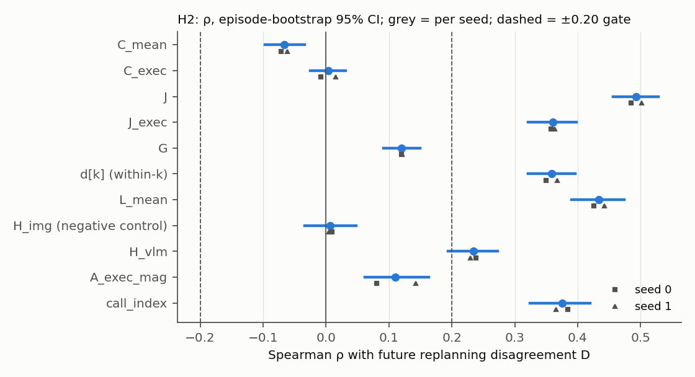

# S2b: semantic trust horizon. H2 (does residual geometry predict future replanning disagreement?)

Label: **DISCOVERY.** No execution horizon other than h = 5 was run. Everything below is correlational, and none
of it shows that chunk length causes anything. Preregistration: `configs/cag/S2b_prereg.yaml`. Analysis:
`src/analysis/analyze_s2b.py` (`h2`). Post-hoc checks are marked **EXPLORATORY**
(`src/analysis/s2b_exploratory.py`, `E2`).

## Definitions

* **D**, from the S3 definition, unchanged:
  * call c (step t) predicts a(t+k | t), and call c+1 (step t+5) predicts the same steps;
  * overlap k = 5..9 ↔ j = k − 5;
  * computed on the executed (CAG-combined) chunks;
  * D_combined = L2 over dims 0–6 after dividing by (q99 − q01)/2.
* **Primary unit:** call level, D̄(c) = mean over k = 5..9.
  * Data: 5,849 call rows from the S episodes of 260 valid pairs (29,245 (c, k) rows).
  * Mean D̄ = 0.48 (S2 pilot S: 0.52).
* **D_cond:** the same disagreement measured on the *conditioned-branch* chunks of consecutive calls. It does not
  contain the executed residual, so it is the mechanical-coupling check. Mean 0.37.
* **Predictors:** features of call c (normalized, combined): C_mean, C_exec, J, J_exec, G, and d[k] at the
  overlapping k.

## Results

Spearman ρ with D̄; 95 % CIs by episode bootstrap and task-cluster bootstrap:

| feature | ρ [episode CI] | task-cluster CI | seed 0 / seed 1 | tasks same sign | within-episode ρ | partial \| L_mean | partial \| call idx | ρ vs D_cond [CI] | gate |
|---|---|---|---|---|---|---|---|---|---|
| **J** | **0.493 [0.456, 0.529]** | [0.372, 0.584] | 0.485 / 0.501 | **13/13** | **0.428** [0.396, 0.457] | **0.284** | 0.413 | **0.383** [0.340, 0.420] | **PASS** |
| **J_exec** | **0.360 [0.321, 0.398]** | [0.233, 0.460] | 0.358 / 0.363 | 12/13 | 0.269 | 0.123 | 0.269 | 0.274 | **PASS** |
| **d[k], within-k (k = 5..9)** | **0.358 [0.321, 0.396]** | | 0.350 / 0.367 | 13/13 | 0.334 | ≈ 0 at k = 5–7, 0.12–0.19 at k = 8–9 | | 0.229 [0.190, 0.268] | **PASS** (magnitude) |
| G | 0.120 [0.091, 0.150] | [0.090, 0.145] | 0.12 / 0.12 | 13/13 | 0.118 | 0.092 | 0.158 | 0.092 | fail (\|ρ\| < 0.20) |
| C_mean | −0.066 [−0.097, −0.034] | [−0.143, 0.003] | −0.07 / −0.06 | 8/13 | −0.076 | −0.214 | −0.034 | −0.116 | fail |
| C_exec | 0.004 [−0.025, 0.032] | | −0.01 / 0.02 | 5/13 | −0.003 | −0.127 | 0.025 | −0.061 | fail |
| *comparators* | | | | | | | | | |
| L_mean (residual magnitude) | 0.434 [0.391, 0.474] | [0.309, 0.555] | 0.43 / 0.44 | 13/13 | 0.377 | — | 0.363 | 0.289 | |
| call index (episode phase) | 0.376 [0.324, 0.419] | | 0.38 / 0.37 | 12/13 | 0.227 | 0.285 | — | 0.357 | |
| vlm entropy (S3 lead) | 0.234 [0.194, 0.273] | | 0.24 / 0.23 | 12/13 | 0.175 | 0.240 | 0.179 | 0.275 | |
| generic magnitude ‖A_S‖ | 0.110 [0.062, 0.164] | | 0.08 / 0.14 | 10/13 | 0.124 | | | 0.027 | |
| **image-only entropy (negative control)** | **0.007 [−0.034, 0.048]** | | 0.01 / 0.00 | 6/13 | 0.005 | | | 0.009 | null |

Further detail:
* **J per task:** ρ ranges 0.16 (task 6) to 0.62 (task 5). It is positive in every task, including the at-ceiling
  tasks 6 and 8.
* **D̄ by J decile:** 0.22, 0.28, 0.33, 0.38, 0.39, 0.46, 0.46, 0.55, 0.70, 1.04. This is monotone, and the top
  decile has 4.8× the disagreement of the bottom decile.
* **Secondary components (point ρ):** J's relationship holds per component. Translation-J vs D_trans is 0.44, and
  rotation-J vs D_rot is 0.42. Gripper-J vs D_grip is 0.31.
* **d[k] within-horizon:** ρ rises with k (k = 5: 0.33 … k = 9: 0.39). The image-entropy control stays at
  −0.01…0.05 at every k.

## H2 gate (preregistered)

| criterion | J | J_exec | d[k] |
|---|---|---|---|
| (a) \|ρ\| ≥ 0.20, episode-bootstrap CI excludes 0 | yes (0.49) | yes (0.36) | yes (0.36) |
| (b) same sign in both seeds | yes | yes | yes |
| (b) same sign in ≥ 10 of the tasks with ≥ 20 rows | 13/13 | 12/13 | 13/13 |
| qualifier: magnitude-driven (\|partial \| L_mean\| < 0.10) | **no** (0.28) | no (0.12) | n/a; partial ≈ 0 at k ≤ 7 |
| qualifier: mechanical (vanishes on D_cond) | **no** (0.38) | no | no (0.23) |

**H2: PASS.** Residual instability J predicts how much the next chunk will disagree with the current one, with
|ρ| ≈ 0.5. It is consistent across both seeds and all 13 tasks. It survives within-episode demeaning. It is not
only residual magnitude, and it is not only the mechanical effect of executing the residual.

d[k] passes the numerical gate. It is, however, essentially residual magnitude: with L_mean partialled out, the
within-k ρ is ≈ 0 for k = 5–7. It adds nothing beyond L.

## How specific is the signal? (EXPLORATORY, post hoc)

| check | ρ |
|---|---|
| J vs D̄ | 0.493 |
| roughness of the conditioned chunk itself, J_cond = mean ‖A_cond[k+1] − A_cond[k]‖ | 0.391 |
| roughness of the unconditioned chunk | 0.351 |
| roughness of the executed CAG chunk | 0.457 |
| partial ρ(J, D̄ \| J_cond) | **0.353** (0.354 / 0.353 per seed) |
| partial ρ(J_cond, D̄ \| J) | 0.144 |
| **partial ρ(J, D̄ \| L_mean, call index, J_cond jointly)** | **0.073** |

* J carries more about future disagreement than the conditioned chunk's own roughness does (0.35 vs 0.14 in the
  two partial directions). In that limited sense it is residual-specific.
* But once residual magnitude, episode phase and chunk roughness are controlled **jointly**, J's unique
  contribution falls to ρ ≈ 0.07.
* Most of what J predicts is shared with signals that need no counterfactual pass: how far into the episode the
  robot is, how big the language effect is, and how jagged the policy's own chunk is.

## Interpretation

* There is a real, robust, task-general signal: when the language-conditioned and language-masked chunks disagree
  in a jagged way along the horizon, the policy's next replanned chunk disagrees more with the current one. That
  is the minimal empirical precondition for a "semantic trust horizon".
* Two caveats limit what it licenses.
  1. **Disagreement is not failure, and correlation is not a horizon effect.** S2b never varied h. Whether
     executing fewer steps when J is high would help is an untested interventional question.
  2. **Most of the signal is generic.** Episode phase (call index ρ = 0.38) and residual magnitude (0.43) carry
     most of it, and the unique residual-geometry part is small (0.07 after joint control). Prior work already
     makes generic internal-dynamics signals → adaptive chunk length its core claim: "Knowing When to Stop"
     (attention dynamics) and GeoAAC (flow-denoising geometry). A J-based horizon rule would need to beat a
     baseline built on those generic signals before it could be called new.
* The image-only attention entropy stays null (ρ = 0.007), confirming the S3 negative result on 5,849 new calls.
  The vlm entropy lead from S3 replicates at ρ = 0.23 [0.19, 0.27].
