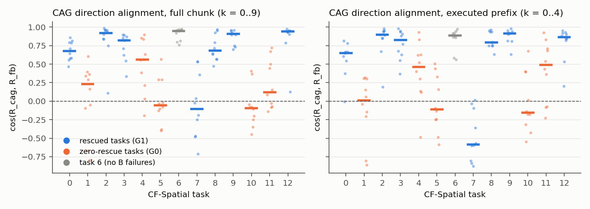

# S2c-0: does CAG's direction point along the faithful-vs-biased action contrast?

Label: **DISCOVERY / MECHANISTIC.** Setup, validity and preregistration: `S2C0_SEMANTIC_CONTROLLABILITY.md`.

## Definitions

Both residuals are computed with the same noise ξs (s = 0, 1) on the regenerated S2b call-0 observation:
* R_cag = A_f − A_u: CAG's direction. The executed CAG shift is (ω − 1) R_cag = 0.5 R_cag.
* R_fb = A_f − A_b: the actual faithful-vs-training-instruction contrast.

Metrics, averaged over the 2 seeds:
* **ALIGN** = cos(R_cag, R_fb). Variants: full flattened chunk (PRIMARY), executed prefix k = 0..4, each k,
  translation, rotation.
* **P_cov** = (ω − 1) ⟨R_cag, R_fb⟩ / ‖R_fb‖² with ω = 1.5 fixed. It is the fraction of the faithful-vs-biased
  contrast that CAG's executed shift covers along that contrast. This is an amplitude measure; nothing is tuned.
* Near-zero rule: no residual fell below 1e-3 (0 NaN).

## Results (task medians over 10 scenes)

| task | group | S2b rescue rate | ALIGN (full) | ALIGN (exec k0–4) | ALIGN trans | ALIGN rot | P_cov | ‖R_cag‖ |
|---|---|---|---|---|---|---|---|---|
| 0 | G1 | 0.25 | 0.68 | 0.65 | 0.54 | 0.84 | 0.30 | 0.92 |
| 2 | G1 | 0.23 | 0.92 | 0.90 | 0.97 | 0.67 | 0.27 | 1.84 |
| 3 | G1 | 0.21 | 0.82 | 0.82 | 0.85 | 0.78 | 0.33 | 0.88 |
| **7** | G1 | **0.40** | **−0.11** | **−0.58** | 0.38 | −0.52 | **−0.06** | 1.36 |
| 8 | G1 | 0.50 | 0.68 | 0.79 | 0.66 | 0.94 | 0.24 | 2.14 |
| 9 | G1 | 0.80 | 0.91 | 0.92 | 0.97 | 0.58 | 0.40 | 1.50 |
| 12 | G1 | 0.50 | 0.94 | 0.86 | 0.96 | 0.77 | 0.40 | 2.79 |
| 1 | G0 | 0 | 0.23 | 0.01 | 0.24 | 0.09 | 0.07 | 0.52 |
| 4 | G0 | 0 | 0.56 | 0.46 | 0.24 | 0.77 | 0.11 | 0.73 |
| 5 | G0 | 0 | −0.06 | −0.11 | −0.16 | 0.01 | −0.03 | 0.94 |
| 10 | G0 | 0 | −0.10 | −0.16 | −0.37 | 0.34 | −0.04 | 0.71 |
| 11 | G0 | 0 | 0.12 | 0.49 | 0.18 | −0.06 | 0.06 | 0.52 |
| 6 | excl. | — | 0.95 | 0.89 | 0.96 | 0.95 | 0.37 | 1.71 |

Group statistics:

| metric | G0 median | G1 median | Cliff's δ | median diff [95 % CI] | LOTO δ range | G0 below G1 median | ρ with rescue rate [CI] | preregistered deficiency |
|---|---|---|---|---|---|---|---|---|
| **ALIGN (full)** | 0.12 | 0.82 | −0.71 | [−0.98, −0.12] | [−1.00, −0.67] | 5/5 | 0.57 [−0.04, 0.89] | **yes** |
| ALIGN (exec) | 0.01 | 0.82 | −0.71 | [−1.01, −0.19] | [−1.00, −0.67] | 5/5 | 0.60 [−0.03, 0.93] | (yes) |
| ALIGN translation | 0.18 | 0.85 | **−1.00** | [−1.22, −0.30] | [−1.00, −1.00] | 5/5 | **0.81 [0.41, 0.95]** | (yes) |
| ALIGN rotation | 0.09 | 0.77 | −0.54 | [−0.84, +0.10] | | 4/5 | 0.36 | no |
| **P_cov** | 0.06 | 0.30 | −0.71 | [−0.43, −0.15] | [−1.00, −0.67] | 5/5 | 0.60 [−0.03, 0.94] | **yes** |
| ‖R_cag‖ (S2b leverage) | 0.71 | 1.50 | −0.89 | [−1.61, −0.19] | [−1.00, −0.86] | 5/5 | 0.82 [0.52, 0.97] | — |

Per horizon k (group medians, G0 vs G1): ALIGN is 0.31 vs 0.79 at k = 0, then −0.04…0.14 vs 0.77–0.92 at k = 2–8.
The G0 deficit is present at every k and largest in the late chunk (δ −0.83 to −0.94 at k = 5–9).

Scenes with ALIGN < 0: G0 24/50, G1 6/70 (all 6 in task 7).

## Reading

* **In the zero-rescue tasks, CAG's direction is nearly orthogonal to the faithful-vs-biased contrast.** The median
  cosine is 0.12 (exec prefix 0.01), against 0.82 in rescued tasks. Tasks 5 and 10 are negative.
* CAG covers a median 6 % of the faithful-vs-biased gap at ω = 1.5 (P_cov), against 30 % in rescued tasks.
* Masking the language moves the action (‖R_cag‖ 0.71), and the instructions do separate the actions (SCNR ≈ 2).
  But the language-masked reference is not on the far side of the training-instruction action. Amplifying
  "faithful minus masked" therefore does not push away from the biased behaviour.
* This is the descriptive signature of the **direction-limited / CAG-reference failure** regime. With
  ALIGN ≈ 0 and P_cov ≈ 0.06, amplitude scaling within the current CAG direction would mostly push orthogonally
  to the semantic contrast. That reading is an inference from geometry; no ω other than 1.5 was run.

**Task 7 is a clear counter-example.**
* It is rescued in 8/20 B failures, yet it has the most misaligned direction of all tasks (ALIGN −0.11; exec
  prefix −0.58), negative P_cov and the lowest SCNR of all tasks (1.32).
* Its biased instruction is "black bowl next to the cookie box", and the bowl sits right next to the faithful
  object. At call 0 the faithful and biased chunks are close and the residual points elsewhere, yet CAG still
  rescues.
* So call-0 alignment is **not necessary** for rescue. The mechanism, if it is one, does not explain all tasks.
* Task 7 is also why no G0 task falls below the G1 *minimum* on any metric, so the preregistered per-task
  ("mixed regime") pattern is empty.

## Preregistered status

* ALIGN (full) and P_cov meet the deficiency criterion: δ ≤ −0.60, CI excluding 0, LOTO all negative, 5/5 below
  the G1 median.
* Neither passes the **generic control**, which requires |δ(metric)| > |δ(generic action magnitude)| = 1.00.
* The "misorientation" interpretation also requires SCNR to be *comparable* (δ > −0.33), and it is not
  (δ = −0.60).
* The preregistered rules therefore do **not** certify the direction-limited regime. See
  `S2C0_RESEARCH_DECISION.md`.

## Scene-matched pairs (EXPLORATORY, post hoc)

In each pair, both tasks have the identical source scene, init-state file and 4-instruction set. Only the
instructed object differs.

| pair (rescued / zero-rescue) | rescue rate | ALIGN | ALIGN exec | P_cov | SCNR | ‖R_cag‖ | ‖A_f‖ |
|---|---|---|---|---|---|---|---|
| 0 cookie box / 1 ramekin | 0.25 / 0 | 0.68 / 0.23 | 0.65 / 0.01 | 0.30 / 0.07 | 2.49 / 2.09 | 0.92 / 0.52 | 1.356 / 1.290 |
| 3 cookie box / 11 bowl next to plate | 0.21 / 0 | 0.82 / 0.12 | 0.82 / 0.49 | 0.33 / 0.06 | 2.47 / 1.35 | 0.88 / 0.52 | 1.308 / 1.280 |
| 12 bowl on cabinet / 4 ramekin | 0.50 / 0 | 0.94 / 0.56 | 0.86 / 0.46 | 0.40 / 0.11 | 5.80 / 2.73 | 2.79 / 0.73 | 1.385 / 1.304 |

* Holding the scene, the training instruction and the instruction set fixed, the instructed object alone changes
  CAG's alignment and coverage. In 3/3 pairs the zero-rescue member is lower on ALIGN, P_cov, SCNR and leverage.
* It is also lower on generic magnitude ‖A_f‖ in 3/3 pairs.
* Three pairs is too few to separate these (1/8 by chance for any one metric).
