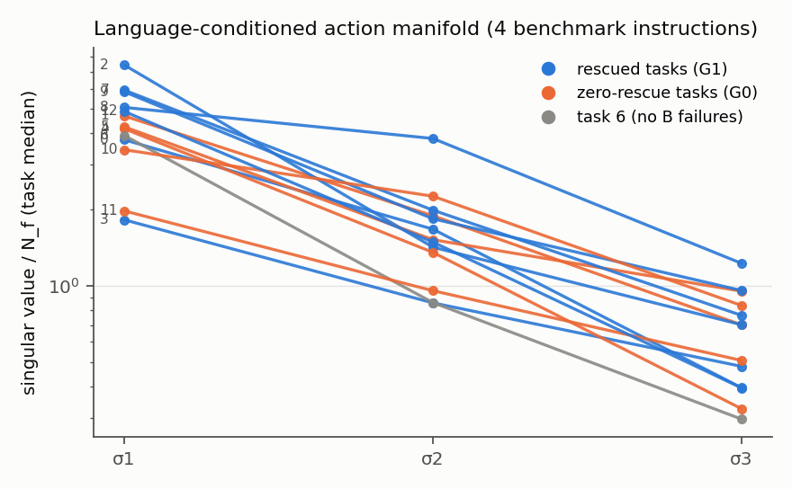
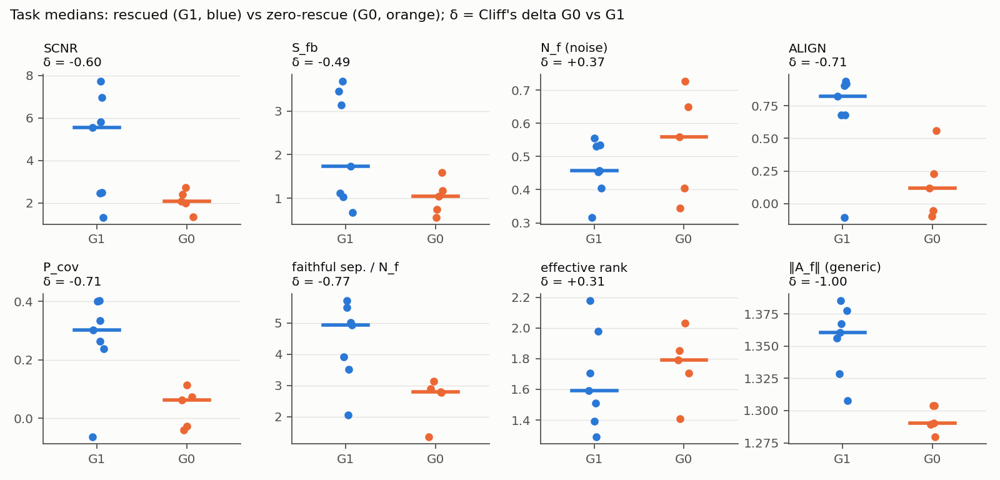

# S2c-0: the multi-language action manifold

Label: **DISCOVERY / MECHANISTIC.** Setup, validity and preregistration: `S2C0_SEMANTIC_CONTROLLABILITY.md`.

## Definition

For each scene and seed (0, 1), the M = 4 benchmark instructions of that scene give chunks A_i (10 × 7, normalized
units, same noise). Every task has M = 4, so ranks are comparable across tasks.

* X_i = vec(A_i − mean_j A_j); stack the 4 rows; take the singular values σ1 ≥ σ2 ≥ σ3 (rank ≤ 3).
* Effective rank = exp(entropy of σ² / Σσ²), range 1–3. PC1 explained variance = σ1² / Σσ².
* Pairwise distances: 6 pairs. Faithful separation = mean distance from A_f to the other 3. Ratios to N_f (the
  policy-noise distance) are the SNR versions.
* A_u (language-masked) is reported as its distance to the instruction centroid.
* No learned embedding. All values are seed-averaged, then taken as task medians.

## Results

| task | group | S2b rescue rate | σ1/N_f | σ2/N_f | σ3/N_f | eff. rank | PC1 EV | mean pairwise / N_f | faithful sep. / N_f | ‖A_u − centroid‖ / N_f |
|---|---|---|---|---|---|---|---|---|---|---|
| 0 | G1 | 0.25 | 3.77 | 1.67 | 0.40 | 1.70 | 0.81 | 3.27 | 3.51 | 1.18 |
| 2 | G1 | 0.23 | 7.44 | 1.42 | 0.70 | 1.29 | 0.94 | 5.55 | 5.02 | 1.97 |
| 3 | G1 | 0.21 | 1.82 | 0.86 | 0.48 | 1.98 | 0.75 | 1.55 | 2.06 | 1.28 |
| 7 | G1 | 0.40 | 5.92 | 1.99 | 0.76 | 1.51 | 0.88 | 4.81 | 3.92 | 1.63 |
| 8 | G1 | 0.50 | 5.06 | 3.81 | 1.23 | 2.18 | 0.63 | 5.04 | 5.71 | 1.91 |
| 9 | G1 | 0.80 | 5.83 | 1.84 | 0.96 | 1.59 | 0.87 | 4.70 | 5.49 | 1.31 |
| 12 | G1 | 0.50 | 4.88 | 1.49 | 0.40 | 1.39 | 0.91 | 3.70 | 4.93 | 1.71 |
| 1 | G0 | 0 | 4.68 | 1.89 | 0.70 | 1.71 | 0.82 | 4.04 | 3.13 | 1.37 |
| 4 | G0 | 0 | 4.17 | 1.35 | 0.33 | 1.41 | 0.90 | 3.30 | 2.90 | 1.48 |
| 5 | G0 | 0 | 4.24 | 1.52 | 0.95 | 1.79 | 0.81 | 3.55 | 2.80 | 2.29 |
| 10 | G0 | 0 | 3.44 | 2.26 | 0.84 | 2.03 | 0.67 | 3.45 | 2.78 | 1.36 |
| 11 | G0 | 0 | 1.98 | 0.96 | 0.51 | 1.85 | 0.79 | 1.70 | 1.35 | 1.12 |
| 6 | excl. | — | 3.92 | 0.86 | 0.30 | 1.30 | 0.93 | 3.01 | 2.94 | 1.60 |

σ/N_f are task medians of the per-scene profiles. Per-scene values are in `results/S2c0/s2c0_summary.json`
(`scenes.*.sv_over_Nf`).

Group statistics:

| metric | G0 median | G1 median | Cliff's δ | median diff [95 % CI] | G0 below G1 median | ρ with rescue rate [CI] |
|---|---|---|---|---|---|---|
| effective rank | 1.79 | 1.59 | +0.31 | [−0.30, +0.52] | 1/5 | −0.25 |
| PC1 explained variance | 0.81 | 0.87 | −0.26 | [−0.20, +0.09] | 4/5 | 0.22 |
| mean pairwise distance (raw) | 1.82 | 1.98 | −0.09 | [−1.25, +0.68] | — | — |
| mean pairwise / N_f (spread SNR) | 3.45 | 4.70 | −0.43 | [−3.00, +0.35] | 5/5 | 0.50 [−0.03, 0.78] |
| **faithful separation / N_f** | **2.80** | **4.93** | **−0.77** | **[−3.58, −0.62]** | 5/5 | **0.82 [0.42, 0.95]** |
| ‖A_u − centroid‖ / N_f | 1.37 | 1.63 | −0.09 | [−0.55, +0.66] | 4/5 | 0.12 |

## Reading

* **No manifold collapse.** In every task the four benchmark instructions produce distinct action chunks:
  * mean pairwise spread 1.7–5.6 × the policy-noise distance;
  * effective rank 1.3–2.2 out of a possible 3;
  * the same raw spread in both groups (δ = −0.09).

  Language creates a structured action response in zero-rescue tasks too. They are not tasks where "all
  instructions collapse to one action mode".
* The rescued tasks' manifolds are slightly *more one-dimensional* (PC1 EV 0.87 vs 0.81; effective rank 1.59 vs
  1.79), but none of these differences is reliable.
* **What differs is where the faithful instruction sits.** In G0 the faithful chunk is not separated from the
  others relative to noise: faithful separation/N_f is 2.8 vs 4.9, δ = −0.77, CI excluding 0, 5/5 below, task
  ρ = 0.82. In particular it is closest to the training-bowl chunk (`S2C0_SEMANTIC_CONTROLLABILITY.md`). The
  manifold is rich, but the faithful instruction lies in its crowded region.
* The language-masked chunk A_u lies about the same distance from the instruction centroid in both groups. The
  masked reference is not anomalous in G0. What differs is its position *relative to the faithful-vs-biased
  axis*, which is the ALIGN result (`S2C0_CAG_DIRECTION_ANALYSIS.md`).

**Preregistered status.** faithful separation/N_f meets the deficiency criterion (δ ≤ −0.60, CI excluding 0, LOTO
all negative, 5/5). It fails the generic control (|δ| 0.77 < |δ(‖A_f‖)| 1.00). Effective rank, PC1 EV and
spread SNR show no deficiency.

**State level** (S2b pairs; within-task AUROC in parentheses):

| target | faithful separation / N_f | task-ID baseline (seed transfer) |
|---|---|---|
| rescue among B failures | 0.83 (0.71) | 0.87 / 0.89 |
| semantic correction among biased-first | 0.84 (0.75) | 0.89 / 0.91 |

This is the strongest within-task signal in the whole programme so far.
* SCNR within-task: 0.59 / 0.65.
* ALIGN within-task: 0.37 / 0.38. ALIGN is a between-task signal only.
* EXPLORATORY: a 4-feature logistic regression gets LOTO AUROC 0.70 for rescue and 0.79 for semantic
  correction.
