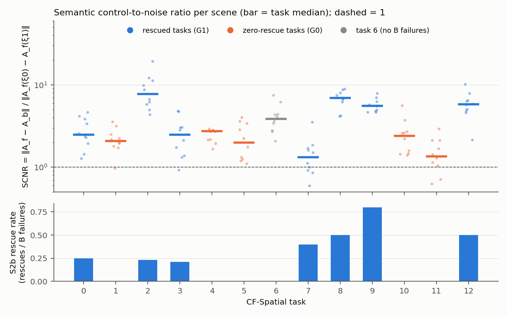
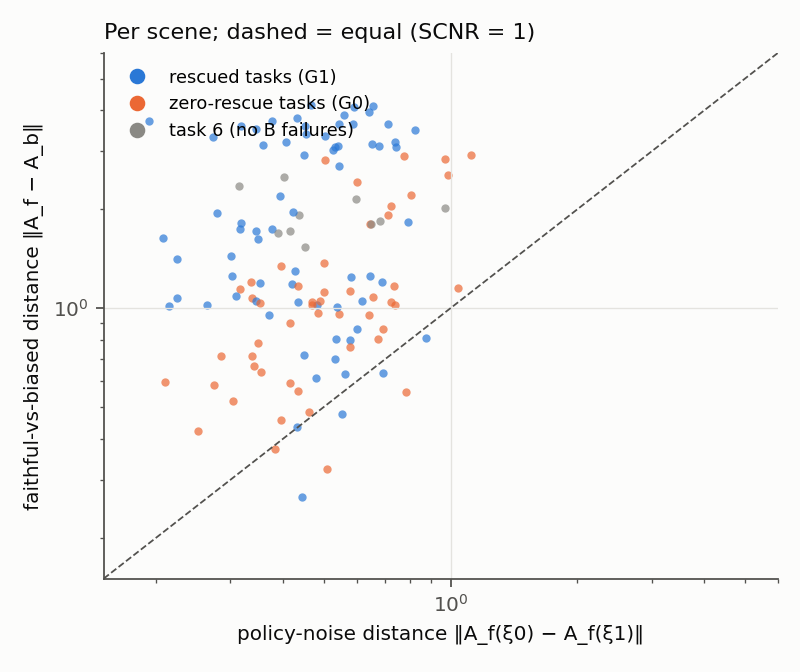

# S2c-0: semantic controllability (SCNR) of the frozen π0.5 on CF-Spatial

Label: **DISCOVERY / MECHANISTIC**. No rollouts. Uses only the already-consumed S2b states 20–29 and the S2b
outcome labels. CAG, ω, h were not modified, no method was implemented, and states 30–49 were not touched.

Preregistration:
* `configs/cag/S2c0_prereg.yaml` and the language manifest `configs/cag/S2c0_language_conditions.json`.
* Both were frozen in `results/S2c0/PREREG_FROZEN.txt` (2026-10-05T15:39:57+08:00) before any language query.
* They were written after the S2b outcomes were known. The S2b rescue structure is what motivates this phase, and
  the task groups were fixed from it.

Code:
* `scripts/audit/s2c0_language_conditions.py`
* `scripts/audit/s2c0_regen_call0_obs.py`
* `scripts/run_cag/s2c0_language_query.py`
* `src/analysis/analyze_s2c0.py` → `results/S2c0/s2c0_summary.json`
* Post hoc: `src/analysis/s2c0_exploratory.py` → `results/S2c0/s2c0_exploratory.json` (EXPLORATORY)

## Setup and validity

**Observations.** S2b stored hashes, not images. The 130 call-0 policy inputs (13 tasks × states 20–29) were
regenerated by replaying the S2b client's exact env construction and reset order.
* **130/130** scenes match the S2b static-geometry and sim-state fingerprints and the call-0 observation hash of
  all four S2b runs.

**Language conditions.** Benchmark strings only, resolved before any query.
* Every CF-Spatial scene's BDDL `:init` block is identical to exactly one LIBERO-Spatial training scene. Its
  init-state file is byte-identical to that training scene's init file.
* Each scene therefore has exactly four benchmark instructions, one per listed goal condition:
  * l_f: the CF prompt;
  * l_b: the source training instruction, whose subject is the biased object `akita_black_bowl_1`;
  * two l_o: the cookie box / ramekin / other-bowl instruction not already used.
* l_u is CAG's language-masked pass.
* Tasks 0/1, 3/11 and 12/4 share the source scene and the instruction set; only the faithful member differs.

| task | l_f object | l_b (training instruction) | l_o |
|---|---|---|---|
| 0 | cookie box | bowl between the plate and the ramekin | bowl next to the ramekin; ramekin |
| 1 | ramekin | bowl between the plate and the ramekin | bowl next to the ramekin; cookie box |
| 2 | cookie box | bowl next to the ramekin | bowl next to the cookie box; ramekin |
| 3 | cookie box | bowl from table center | bowl next to the plate; ramekin |
| 4 | ramekin | bowl on the cookie box | bowl on the wooden cabinet; cookie box |
| 5 | ramekin | bowl in the top drawer of the wooden cabinet | bowl on the wooden cabinet; cookie box |
| 6 | bowl on the cookie box | bowl on the ramekin | cookie box; ramekin |
| 7 | cookie box | bowl next to the cookie box | bowl on the stove; ramekin |
| 8 | cookie box | bowl on the stove | bowl on the wooden cabinet; ramekin |
| 9 | bowl next to the ramekin | bowl next to the plate | cookie box; ramekin |
| 10 | ramekin | bowl on the wooden cabinet | bowl on the stove; cookie box |
| 11 | bowl next to the plate | bowl from table center | cookie box; ramekin |
| 12 | bowl on the wooden cabinet | bowl on the cookie box | cookie box; ramekin |

**Query.**
* For each scene and noise seed (CRN seeds 0 and 1 = S2b call 0; secondary seeds 1000–1007), the **same** noise
  tensor was passed through the public `noise=` argument for all five conditions.
* Deterministic XLA, pre-guidance chunks, model space.

**Checks** (`results/S2c0/chunks/query_checks.json`), all PASS:

| check | result |
|---|---|
| noise fingerprint identical across the 5 conditions | 130/130 scenes |
| CAG's conditioned pass == plain l_f chunk, bitwise | 130/130 |
| A_f (env) == S2b B call-0 chunk, bitwise | 260/260 seed-scenes |
| A_f (env) == S2b S call-0 a_conditioned, bitwise | 260/260 |
| A_u (env) == S2b S call-0 a_unconditioned, bitwise | 260/260 |

So S2c-0 analyses exactly the chunks that S2b executed from.

Groups, fixed from S2b before any metric:
* **G0 zero-rescue** = tasks 1, 4, 5, 10, 11.
* **G1 rescued** = tasks 0, 2, 3, 7, 8, 9, 12.
* Task 6 is excluded: it had no B failures.

## Metric 1: semantic control-to-noise ratio

Definitions:
* N_f = ‖A_f(ξ0) − A_f(ξ1)‖: policy-noise distance, same observation and instruction.
* S_fb = mean_s ‖A_f(ξs) − A_b(ξs)‖: same noise, faithful vs training instruction.
* SCNR = S_fb / (N_f + 1e-6).
* Full 10×7 chunk, normalized units.

Task medians over 10 scenes:

| task | group | S2b rescue rate | SCNR | S_fb | N_f | SCNR (10 noise draws) | SCNR trans | SCNR rot |
|---|---|---|---|---|---|---|---|---|
| 0 | G1 | 0.25 | 2.49 | 1.12 | 0.41 | 2.62 | 2.30 | 3.86 |
| 2 | G1 | 0.23 | **7.73** | 3.45 | 0.46 | 6.78 | 10.82 | 4.37 |
| 3 | G1 | 0.21 | 2.47 | 1.04 | 0.45 | 2.52 | 3.24 | 2.06 |
| 7 | G1 | 0.40 | **1.32** | 0.68 | 0.54 | 1.34 | 1.56 | 1.04 |
| 8 | G1 | 0.50 | 6.94 | 3.69 | 0.53 | 6.39 | 9.22 | 2.80 |
| 9 | G1 | 0.80 | 5.56 | 1.73 | 0.32 | 5.28 | 8.51 | 2.49 |
| 12 | G1 | 0.50 | 5.80 | 3.13 | 0.56 | 6.29 | 7.93 | 3.66 |
| 1 | G0 | 0 | 2.09 | 0.75 | 0.35 | 1.95 | 2.14 | 2.09 |
| 4 | G0 | 0 | 2.73 | 1.59 | 0.65 | 2.83 | 2.29 | 2.95 |
| 5 | G0 | 0 | 2.00 | 1.04 | 0.56 | 1.65 | 1.95 | 1.91 |
| 10 | G0 | 0 | 2.41 | 1.17 | 0.73 | 2.01 | 2.74 | 1.40 |
| 11 | G0 | 0 | 1.35 | 0.56 | 0.41 | 1.33 | 1.24 | 1.47 |
| 6 | excl. | — | 3.87 | 1.88 | 0.44 | 3.99 | 3.38 | 5.83 |

Group statistics (task medians; Cliff's δ = G0 vs G1; task-cluster bootstrap CI of the median difference;
LOTO = δ with each task left out):

| metric | G0 median | G1 median | δ | median diff [95 % CI] | LOTO δ range | G0 below G1 median | ρ with rescue rate [CI] |
|---|---|---|---|---|---|---|---|
| SCNR | 2.09 | 5.56 | −0.60 | −3.47 [−4.95, +0.24] | [−0.87, −0.53] | 5/5 | 0.53 [−0.10, 0.89] |
| SCNR, 10 noise draws | 1.95 | 5.28 | −0.66 | [−4.77, +0.22] | [−0.87, −0.57] | 5/5 | 0.57 [−0.01, 0.89] |
| S_fb | 1.04 | 1.73 | −0.49 | [−2.70, +0.13] | [−0.67, −0.36] | 5/5 | 0.52 |
| N_f (noise) | 0.56 | 0.46 | +0.37 | [−0.15, +0.27] | [+0.21, +0.64] | 2/5 | −0.31 |
| SCNR translation | 2.14 | 7.93 | −0.71 | [−7.27, −0.004] | [−0.93, −0.64] | 5/5 | 0.59 [0.01, 0.90] |
| SCNR rotation | 1.91 | 2.80 | −0.49 | | | 4/5 | 0.36 |
| SCNR gripper | 0.87 | 0.75 | +0.37 | | | 2/5 | −0.15 |

### Reading

* **Language is not collapsed in the zero-rescue tasks.** Their SCNR ≈ 2: the faithful-vs-training-instruction
  contrast moves the chunk about twice as far as changing the policy noise does. SCNR < 1 occurs in 3/50 G0
  scenes and 4/70 G1 scenes.
* **G1 is bimodal.** Tasks 2, 8, 9 and 12 have SCNR 5.6–7.7, while tasks 0, 3 and 7 (rescued 21–40 %) sit at or
  below the G0 level (1.3–2.5).
  * The group difference is therefore driven by four very controllable tasks, not by a G0 deficit.
  * δ = −0.60 is exactly at the preregistered threshold, but its CI includes 0.
* The difference is carried by **translation**. The gripper has no semantic contrast at call 0 in any task: S_fb
  is 0.008, about equal to its noise.
* N_f is slightly *larger* in G0 (δ = +0.37). The policy is not less noisy there, and SCNR is not inflated in G1
  by a small denominator. G1 has a larger numerator.

**Preregistered result:** SCNR is neither *deficient* in G0 (the CI includes 0) nor *comparable* (δ ≤ −0.33).
Faithful separation relative to noise (sep_snr) **is** deficient: G0 2.80 vs G1 4.93, δ = −0.77, CI
[−3.58, −0.62], LOTO all negative, 5/5 below. That deficiency fails the preregistered generic control
(`S2C0_RESEARCH_DECISION.md`).

### Secondary (EXPLORATORY): what the faithful chunk is close to

Median pairwise distances between the 4 instruction chunks:

| | f–b | f–o1 | f–o2 | b–o1 | b–o2 | o1–o2 |
|---|---|---|---|---|---|---|
| G0 | 1.03 | 1.21 | 1.21 | 1.72 | 1.01 | 2.76 |
| G1 | 1.74 | 2.46 | 1.70 | 1.76 | 1.06 | 1.49 |

In zero-rescue tasks the faithful chunk sits *closest to the training-bowl chunk*: d(f, b) / mean d(f, o) = 0.73,
against 1.08 in G1. The policy's response to "pick up the ramekin" (or "the black bowl next to the plate") at the
first call is nearer to its trained bowl motion than to the other instructions. This fits weak semantic
separation, but the preregistered rules do not test it.
