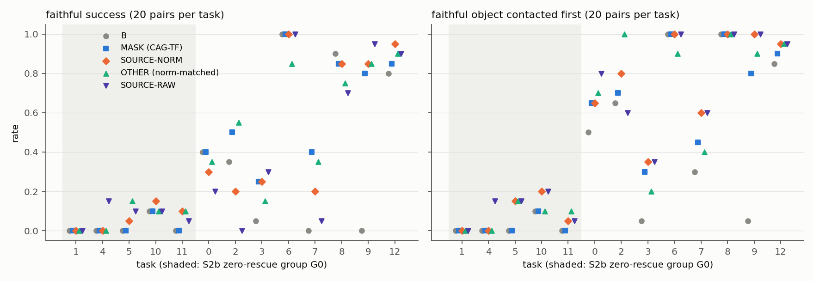

# S2d results: oracle source reference vs masked-language CAG

Label: **ORACLE DIAGNOSTIC.** Preregistration: `S2D_ORACLE_REFERENCE_PREREG.md`, frozen in
`results/S2d/PREREG_FROZEN.txt` (2026-10-05T17:11:42+08:00) before any S2d rollout. Analysis:
`src/analysis/analyze_s2d.py` → `results/S2d/s2d_summary.json`. Figure: `figures/S2d_rates_by_task.png`.

## Validity

| item | result |
|---|---|
| new episodes | 780 = SN, OT, SR × 2 seeds × 130; **780/780 valid**, 0 exceptions |
| B, MASK | reused from S2b (260 pairs each); exact-replay check 4/4 bit-identical whole trajectories |
| per S2d episode vs the S2b B episode of the same (seed, task, state) | geometry 780/780; call-0 observation 780/780; **call-0 faithful chunk == S2b B call-0 chunk, bitwise 780/780**; CRN tuple and fingerprint at every call 780/780; noise identical to S2b B at every common call index 780/780; reference prompt correct 780/780 |
| SN/OT intervention norm == s_mask at every call | max error 2.0e-5, median 4.8e-7 |
| valid 5-way paired sets | **260** (G0: 100, control: 160) |

**Deviation from the run plan (no effect on pairing):** the two SOURCE-RAW servers ran out of GPU memory at start-up,
because three servers per GPU do not fit. They produced no episodes; their logs are in `results/S2d/oom_attempt/`.
SOURCE-RAW was re-run after SN/OT finished, with the identical frozen `run_b_vs_s.sh` invocation. Every condition is
a separate deterministic client with the S2b reset order, so all of the validity checks above hold for SR too.

## Primary outcomes

### G0, S2b zero-rescue tasks 1, 4, 5, 10, 11 (100 pairs)

| | B | MASK | **SOURCE-NORM** | OTHER (norm-matched) | SOURCE-RAW |
|---|---|---|---|---|---|
| faithful success | 0.02 | 0.02 | **0.06** | 0.07 | 0.08 |
| faithful first-contact | 0.02 | 0.02 | **0.08** | 0.07 | 0.11 |
| biased first-contact | 0.82 | 0.86 | 0.75 | 0.81 | 0.77 |
| biased success | 0.81 | 0.76 | **0.59** | 0.75 | 0.66 |
| timeout | 0.12 | 0.16 | **0.29** | 0.12 | 0.15 |
| post-contact failure | 0.01 | 0.03 | 0.06 | 0.06 | 0.06 |
| episode length | 115 | 121 | 137 | 122 | 129 |
| policy calls / episode | 23.4 | 24.6 | 27.8 | 24.8 | 25.8 |
| clipping (% of components, dims 0–5) | 0.01 | 0.80 | 0.32 | 0.45 | 0.49 |
| median per-call intervention norm (model space) | — | 0.420 | 0.458 | 0.419 | 0.528 |
| median server latency (ms) | 170 | 263 | 461 | 470 | — |

Paired comparisons in G0:
* gain/loss = pairs where X = 1, Y = 0 / X = 0, Y = 1;
* p = state-cluster sign-flip permutation;
* CI = state-cluster bootstrap of the paired difference.

| comparison | outcome | X vs Y | gain / loss | p | 95 % CI | seed 0 / seed 1 gain–loss | per-task net (1, 4, 5, 10, 11) |
|---|---|---|---|---|---|---|---|
| **SN − MASK** | faithful success | 0.06 vs 0.02 | 4 / 0 | 0.125 | [+0.01, +0.08] | 2–0 / 2–0 | 0, 0, +1, +1, +2 |
| **SN − MASK** | faithful first-contact | 0.08 vs 0.02 | 6 / 0 | 0.126 | [+0.01, +0.13] | 3–0 / 3–0 | 0, 0, +3, +2, +1 |
| SN − MASK | biased first-contact | 0.75 vs 0.86 | 1 / 12 | 0.024 | [−0.20, −0.03] | 1–6 / 0–6 | 0, 0, −5, −5, −1 |
| SN − MASK | biased success | 0.59 vs 0.76 | 5 / 22 | **0.007** | [−0.28, −0.06] | 2–11 / 3–11 | 0, −5, −3, −7, −2 |
| **SN − OT** | faithful success | 0.06 vs 0.07 | 2 / 3 | 1.00 | [−0.06, +0.03] | 2–2 / 0–1 | 0, 0, −2, +1, 0 |
| **SN − OT** | faithful first-contact | 0.08 vs 0.07 | 3 / 2 | 1.00 | [−0.03, +0.06] | 2–1 / 1–1 | 0, 0, 0, +2, −1 |
| SN − OT | biased success | 0.59 vs 0.75 | 2 / 18 | **0.001** | [−0.25, −0.07] | 1–12 / 1–6 | 0, −6, −2, −8, 0 |
| OT − MASK | faithful success | 0.07 vs 0.02 | 5 / 0 | 0.25 | [0.00, +0.11] | 2–0 / 3–0 | 0, 0, +3, 0, +2 |
| SR − SN (secondary) | faithful first-contact | 0.11 vs 0.08 | 4 / 1 | 0.50 | [−0.01, +0.09] | | 0, +3, 0, 0, 0 |
| SR − MASK (secondary) | faithful first-contact | 0.11 vs 0.02 | 9 / 0 | 0.033 | [+0.02, +0.17] | | 0, +3, +3, +2, +1 |

Grounding transitions in G0 (first object contacted), MASK → SN:
* biased → biased 74;
* **biased → neither 8**;
* biased → faithful 4;
* neither → faithful 2;
* faithful → faithful 2;
* neither → neither 9;
* neither → biased 1.

Task 1 ("pick up the ramekin" in the "between the plate and the ramekin" training scene) is untouched by every
intervention: biased success 20/20 in all five conditions.

### Control tasks 0, 2, 3, 6, 7, 8, 9, 12 (160 pairs)

| | B | MASK | SN | OT | SR |
|---|---|---|---|---|---|
| faithful success | 0.44 | **0.63** | 0.58 | 0.59 | 0.51 |
| faithful first-contact | 0.55 | 0.73 | **0.79** | 0.76 | 0.79 |
| biased success | 0.41 | 0.21 | 0.20 | 0.21 | 0.20 |
| post-contact failure | 0.14 | 0.12 | **0.25** | 0.20 | **0.31** |
| timeout | 0.08 | 0.10 | 0.14 | 0.18 | 0.16 |

Paired comparisons on the control tasks:

| comparison | result |
|---|---|
| SN − MASK, faithful success | −0.056, 11/20, p = 0.24, CI [−0.14, +0.03]; per-task net: task 2 −6, task 7 −4, task 0 −2, task 12 +2, task 9 +1 |
| SN − MASK, faithful first-contact | +0.069, 16/5, p = 0.079 |
| SR − MASK, faithful success | −0.119, p = 0.026 (secondary) |

On the controls, the source reference improves *grounding* slightly over MASK but converts more of it into
post-contact failures. Faithful success is therefore no better than MASK, and SOURCE-RAW is worse.

## Hard gate (preregistered)

| criterion | rule | result | |
|---|---|---|---|
| **A** | SN > MASK in G0 on faithful success or first-contact, p < 0.025 and CI > 0 | p = 0.125 / 0.126 (CIs exclude 0, but neither reaches p < 0.025) | **FAIL** |
| B | net ≥ +2 in ≥ 2 G0 tasks | first-contact: tasks 5 (+3) and 10 (+2); success: task 11 only | (moot) |
| **C** | SN > OT in G0 | −0.01 / +0.01, p = 1.0 | **FAIL** |
| D | norm / clipping / calls | norm error 4.8e-7; median norm ratio SN/MASK 1.09 (within ±10 %); clipping −0.48 pp; h = 5 | pass |
| E | no large control regression | SN − MASK faithful success −5.6 pp, p = 0.24 (not significant) | pass |

**Decision: C. FAIL.** A fails, and so does C.
