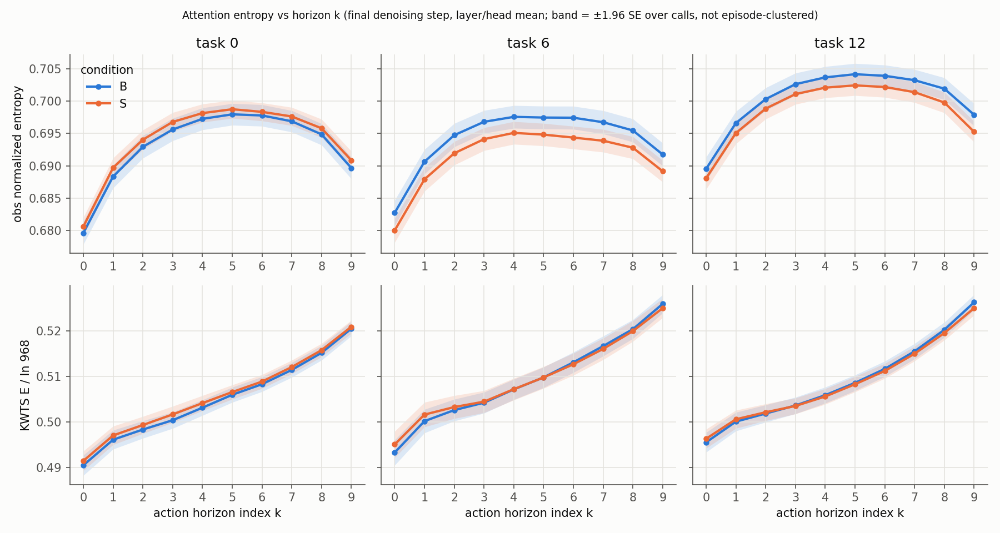
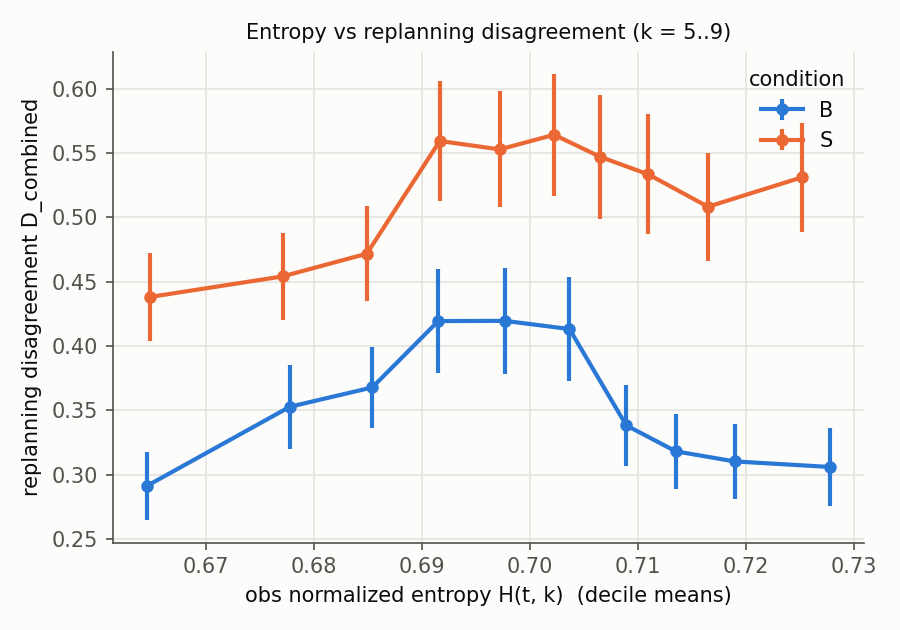

# S3 attention pilot — π0.5 action-expert → observation attention entropy (DIAGNOSTIC ONLY)

Label: **PILOT / EXPLORATORY.** This is not a reproduction of "Knowing When to Stop" (KWTS), and no stopping
threshold is implemented or applied. The data are the 120 S2 pilot episodes (B and S, tasks 0/6/12, 20 initial
states each): 2,941 policy calls, each logged at [denoising_step 10 × layer 18 × head 8 × horizon 10] per
branch. Definitions were preregistered in `configs/cag/S2_pilot_prereg.yaml` before the run. Date: 2026-10-01.

## What was logged (output-preserving; see S2 report for the identity test)

Per call, branch, denoising step, layer, head and horizon index k:
* `obs`: attention renormalised over the **valid image keys**, with `valid_key_count = 512` (base + left-wrist
  image; the right-wrist slot is masked in LIBERO);
* `raw_entropy` H = −Σ p ln p, and `normalized_entropy` = H / ln(valid_key_count);
* the same over all valid prefix keys (`vlm`: images + valid language, 525 for task 0 and 529 for tasks 6/12);
* `obs_mass`;
* the KWTS Eq. 1–2 reference quantity `kwts_E` (head mean, layer sum, over all 968 prefix columns).

Files: `results/S2_pilot/{B,S}/attn/task*_init*.npz` (all episodes) and raw bf16 probs for the first 2 episodes
per task per condition, `results/S2_pilot/{B,S}/raw/` (12.2 GB). Both are gitignored.

**The published 0.95·ln(968) threshold was not used.** The maximum KWTS-normalised entropy observed in 2,941
calls is **0.58** (B) / 0.57 (S), far below 0.95. This confirms on real rollouts the S0 finding that the rule can
never fire on public `pi05_libero`.

Primary scalar (preregistered): obs normalized entropy at the **final** denoising step, mean over layers and heads,
per horizon index k → H[call, k]. Analysis: `src/analysis/analyze_s3_attention.py` →
`results/S2_pilot/s3_summary.json`. Figures: `reports/figures/S3_*.png`.

## S3A — Does entropy increase with horizon?

| | k=0 | 1 | 2 | 3 | 4 | 5 | 6 | 7 | 8 | 9 |
|---|---|---|---|---|---|---|---|---|---|---|
| obs H, B | 0.684 | 0.692 | 0.696 | 0.699 | 0.700 | **0.700** | 0.700 | 0.699 | 0.698 | 0.693 |
| obs H, S | 0.683 | 0.691 | 0.695 | 0.698 | 0.699 | **0.699** | 0.699 | 0.698 | 0.696 | 0.692 |
| vlm H, B | 0.417 | 0.435 | 0.444 | 0.450 | 0.455 | 0.458 | 0.460 | 0.461 | **0.461** | 0.457 |
| KWTS E/ln968, B | 0.493 | 0.499 | 0.501 | 0.503 | 0.505 | 0.508 | 0.511 | 0.514 | 0.518 | **0.524** |
| obs mass, B | 0.277 | 0.278 | 0.275 | 0.273 | 0.273 | 0.275 | 0.277 | 0.281 | 0.286 | 0.293 |

* **Image-only entropy (the user's definition) is an inverted U, not monotone.** It rises over k=0..5 and falls
  over k=6..9, in every task and both conditions. k9 − k0 = +0.009 (episode-bootstrap CI [0.0086, 0.0094] in B;
  per-episode Spearman(k, H) positive in 60/60 episodes, median ρ 0.12). The full dynamic range is ≈0.016 nats/ln N, about 2 % of the value.
* The **KWTS aggregate rises monotonically** with k in every task. This qualitatively reproduces the paper's
  "entropy grows with horizon", but on a quantity that mixes image and language keys, sums over layers, and
  normalises by 968 columns of which ~525 are valid. Part of its rise is a shift of mass onto image tokens at late
  k (obs_mass 0.273 → 0.293), not just a spreading within images.
* The horizon trend is **driven by a few layers**: layer 10 contributes +0.09 (k9−k0) and layer 11 contributes
  −0.04. 12 of 18 layers are positive. Averaging over layers hides opposite-signed structure
  (`reports/figures/S3_layer_horizon_heatmap.png`).
* Across denoising steps the profile is the same shape. The first step is lower overall (0.639 → 0.655).

**S3A answer:** there is a small, systematic horizon dependence. Its shape depends on the definition: it is not
monotone for image-only entropy and is monotone only for the KWTS aggregate.

## S3B — Does entropy predict replanning disagreement?

Preregistered pairs: call c at step t predicts a(t+k|t) for k=5..9; call c+1 at t+5 predicts the same steps. B:
6,770 pairs / 60 episodes; S: 7,335 / 60. D in env action space; D_combined uses per-dimension (q99−q01)/2
scaling from `pi05_libero` norm stats. Spearman, with 95 % CI by episode bootstrap.

| Entropy | D | B ρ [95 % CI] | S ρ [95 % CI] |
|---|---|---|---|
| **obs H (primary)** | **combined** | **−0.048 [−0.113, 0.021]** | **+0.038 [−0.017, 0.095]** |
| obs H | translation | −0.027 [−0.088, 0.043] | +0.070 [0.011, 0.131] |
| obs H | rotation | −0.051 [−0.120, 0.013] | +0.008 [−0.043, 0.056] |
| obs H | gripper | −0.006 [−0.041, 0.029] | +0.009 [−0.036, 0.048] |
| vlm H (secondary) | combined | +0.228 [0.172, 0.277] | +0.172 [0.113, 0.230] |
| KWTS E (secondary) | combined | +0.097 [0.046, 0.146] | +0.081 [0.024, 0.134] |

* **Primary: null.** Image-only entropy does not predict replanning disagreement in either condition. The decile
  plot is non-monotone, peaking at mid entropy. Within-k correlations are −0.08…−0.02 (B) and +0.01…+0.06 (S).
* **Secondary: the vlm entropy (images + language) correlates modestly and consistently** (ρ ≈ 0.17–0.23). In a
  post-hoc check (`src/analysis/s3_confound_checks.py`, EXPLORATORY) this survives demeaning within episode
  (ρ = 0.18 B / 0.16 S) and stratifying by call index (mean ρ = 0.25 / 0.21). So it is not just a between-episode
  or episode-phase artefact. Because it includes the language keys, it is plausibly a *language-vs-image
  allocation* signal rather than a pure action-execution signal.
* CAG raises disagreement overall (D_combined mean 0.35 B → 0.52 S) without changing the entropy profile (S − B
  ≈ −0.001).

## S3C — Does entropy predict failure?

Preregistered episode scalars, AUROC (episode-bootstrap 95 % CI), pooled over tasks. Base rates: B faithful failure
12/60, biased touch 6/60; S 13/60 and 6/60.

| Scalar | B: faithful failure | B: biased touch | S: faithful failure | S: biased touch | B / S: high disagreement (top quartile) |
|---|---|---|---|---|---|
| mean entropy | 0.42 [0.25, 0.59] | 0.56 [0.41, 0.71] | 0.46 [0.28, 0.64] | 0.47 [0.18, 0.75] | 0.47 / 0.54 |
| max entropy | 0.51 [0.33, 0.69] | 0.51 [0.34, 0.68] | 0.66 [0.48, 0.83] | 0.61 [0.31, 0.81] | 0.52 / 0.65 |
| late-horizon (k=5..9) | 0.43 [0.26, 0.62] | 0.58 [0.41, 0.75] | 0.48 [0.30, 0.66] | 0.51 [0.20, 0.82] | 0.48 / 0.56 |
| first-call entropy | 0.47 [0.27, 0.67] | 0.42 [0.07, 0.78] | 0.37 [0.21, 0.56] | 0.18 [0.05, 0.36] | 0.58 / 0.43 |
| **entropy slope over k** | **0.74 [0.61, 0.87]** | 0.72 [0.50, 0.93] | **0.76 [0.62, 0.89]** | 0.80 [0.64, 0.93] | 0.71 / 0.70 |

(AUPRC and within-task AUROC are in `results/S2_pilot/s3_summary.json`. In B, "failed faithful grounding" equals
"biased touch", because every B episode touched exactly one object.)

* Level statistics (mean, max, late-horizon, first call) **do not predict** failure, biased interaction or
  disagreement. All CIs include 0.5. Entropy by outcome class is flat: B mean 0.696 (F-success), 0.692 (F-touch,
  no success), 0.698 (B-success).
* The **entropy slope** has AUROC ≈ 0.72–0.80 across targets and conditions. The post-hoc check shows it is
  **not an early predictor**: restricted to the first 5 calls of an episode, AUROC is 0.50 in B
  (CI [0.29, 0.71]) and 0.68 [0.49, 0.87] in S. Slope correlates with episode length (ρ ≈ 0.22), and failed
  episodes run to the 220-step timeout. The signal therefore describes calls made *during* a failing trajectory
  (e.g. hovering or regrasping); it does not anticipate failure. Calibration was not computed (no probabilistic
  model).

## Gate

The preregistered S3 hypothesis was: image-only action-to-observation entropy tracks horizon and action
unreliability. It is **not supported**.
* The horizon dependence is ≈2 % in size and non-monotone.
* There is no correlation with replanning disagreement.
* No preregistered level statistic predicts failure.
* The one scalar with discrimination (slope) does not anticipate failure.
* The published KWTS threshold is unreachable.

Per the stated gate ("if action-expert entropy does NOT meaningfully correlate with action unreliability/failure,
STOP this branch"), **the S4 adaptive-chunking branch is not justified on this evidence.**

Leads worth at most one preregistered confirmatory test, labelled EXPLORATORY until then:
1. the image+language (vlm) entropy ↔ replanning-disagreement correlation (ρ ≈ 0.2, robust to within-episode
   demeaning);
2. layer-specific structure (layers 10/11 carry opposite-signed horizon trends).
